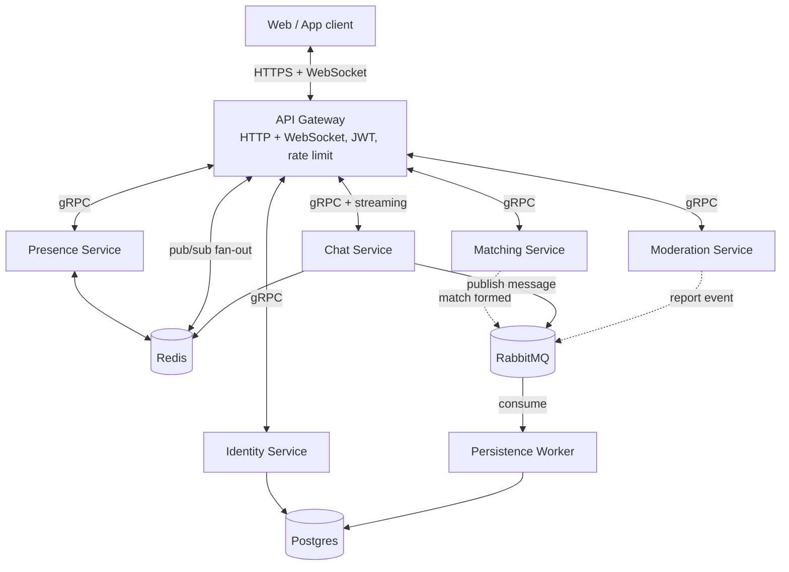

# System Design: Flamingo Chat

Companion to [PRD.md](PRD.md). This defines service boundaries, the tech stack, inter-service data contracts, observability, infrastructure/deployment, and the proposed repo layout. Concrete metrics/benchmarks referenced here get filled in later during load testing, per the PRD's non-functional requirements - nothing here is a measured number yet, it's the design that will produce them. See [PLAN.md](PLAN.md) for the build order/priority - everything in this doc exists regardless of order, PLAN.md is what gets built first.

Primary language: **Go**, across all services, the gateway, and the workers.

## 1. Service boundaries

| Service | Owns | Talks to |
|---|---|---|
| **API Gateway** | Client-facing HTTP + WebSocket surface, JWT validation, rate limiting, routing, WebSocket connection registry | All services below, via gRPC |
| **Identity Service** | Accounts, pseudonyms, college verification ("badge") status, gender field (verified users only) | Postgres |
| **Matching Service** | Gender-wise match queue, pairing logic, emits match-formed events | Identity (to check badge/gender), Chat (to create the resulting room), RabbitMQ |
| **Chat Service** | Rooms (1:1 and group), membership, invite codes/links, message ingestion | Postgres (room/membership metadata), RabbitMQ (message fan-out + persistence), Redis (invite code lookups) |
| **Presence Service** | Who's online, aggregate counts (unverified/male/female), heartbeats | Redis |
| **Moderation Service** | Reports, blocks, moderation actions | Postgres, can instruct Chat Service to remove a user from a room |
| **Persistence Worker(s)** | Consumes chat messages + moderation events off RabbitMQ, writes to durable storage | Postgres (or a swapped-in store later, see §4) |

Not a service: the frontend (web/app) - it only ever talks to the API Gateway.

## 2. Architecture overview



Every service exposes a `/metrics` endpoint (Prometheus) and propagates trace context (OpenTelemetry, exported to Jaeger) on every gRPC call and broker message, so a single request is traceable end to end: client to gateway to service to broker to worker to database.

## 3. Key data flows

**Message send (1:1 or group):**
1. Client sends a message over its WebSocket connection to whichever Gateway instance it's connected to.
2. Gateway forwards it to Chat Service via gRPC.
3. Chat Service validates membership, publishes the message to RabbitMQ (a `messages` exchange), and also publishes it to a Redis pub/sub channel keyed by room ID.
4. Every Gateway instance subscribes to Redis pub/sub for rooms it has connected clients in, and delivers the message to those clients over their existing WebSocket connections. This solves the "which gateway instance is the recipient connected to" problem without pinning a room to one gateway instance.
5. Independently, Persistence Worker consumes the same message off RabbitMQ and writes it to Postgres for history/moderation. This is decoupled from step 4 - delivery is never blocked waiting on the database write.

**Gender-wise match:**
1. Client (verified, badge holder) requests a match via Gateway.
2. Matching Service checks Identity Service for badge + gender, adds the user to a Redis-backed match queue.
3. When a pair is found, Matching Service calls Chat Service to create a 1:1 room, then notifies both clients via the Gateway (push over their WebSocket connections).

**Group creation + join via code:**
1. Client creates a group via Chat Service (through the Gateway); Chat Service generates an invite code, stores it in Postgres and caches it in Redis for fast lookup.
2. A second client joins via link/code; Chat Service validates the code against Redis (falling back to Postgres on a cache miss), adds membership.

**Live presence counts:**
1. Each Gateway instance sends periodic heartbeats to Presence Service for its connected clients (verification status + gender if set).
2. Presence Service maintains counters in Redis (e.g. sorted sets or plain counters with TTL per connection), aggregates unverified/male/female tallies, and pushes updates to Gateway instances via Redis pub/sub for broadcast to clients.

**Moderation report:**
1. Client reports a user via Gateway → Moderation Service.
2. Moderation Service stores the report in Postgres and publishes a `report-filed` event to RabbitMQ.
3. A moderation worker (or the Moderation Service itself, for near-real-time action) can call Chat Service to remove the reported user from the room immediately, without waiting for human review, if the report meets an auto-action threshold (rate of reports, blocked keywords, etc. - policy TBD).

## 4. Data stores

- **Postgres**: source of truth for accounts, rooms/membership, invite codes, moderation records, and durable chat history.
- **Redis**: presence counters, pub/sub fan-out for real-time delivery, invite-code cache, match queue.
- **RabbitMQ**: decouples "deliver this message now" from "persist this message durably" and from "process this moderation event." Chosen over Kafka for this scale - simpler to operate solo, still a recognized, resume-legible message broker. Chosen over NATS for wider name recognition. Revisit if/when persistence throughput actually needs a log-structured broker.

**Swappable persistence, concretely**: each service accesses its store through a repository interface (e.g. `MessageStore` interface with a Postgres implementation), not raw SQL calls scattered through business logic. This is what makes "swap the database later" (per the PRD) actually possible instead of aspirational - if chat history outgrows Postgres, only the Persistence Worker's storage implementation changes, not the Chat Service or its API.

## 5. Inter-service contracts (gRPC)

All internal calls are gRPC. Proto files are the source of truth for these contracts - sketched here at a high level, not final.

```protobuf
// proto/identity/v1/identity.proto
service IdentityService {
  rpc CreateAccount(CreateAccountRequest) returns (Account);
  rpc VerifyBadge(VerifyBadgeRequest) returns (Account); // college email/OAuth verification
  rpc GetAccount(GetAccountRequest) returns (Account);
  rpc UpdatePseudonym(UpdatePseudonymRequest) returns (Account);
}

// proto/matching/v1/matching.proto
service MatchingService {
  rpc RequestMatch(RequestMatchRequest) returns (stream MatchEvent); // streamed: queued -> matched
  rpc CancelMatch(CancelMatchRequest) returns (CancelMatchResponse);
}

// proto/chat/v1/chat.proto
service ChatService {
  rpc CreateRoom(CreateRoomRequest) returns (Room);
  rpc JoinRoomByCode(JoinRoomByCodeRequest) returns (Room);
  rpc SendMessage(SendMessageRequest) returns (SendMessageResponse);
  rpc StreamRoomEvents(StreamRoomEventsRequest) returns (stream RoomEvent); // gateway subscribes per active room
}

// proto/presence/v1/presence.proto
service PresenceService {
  rpc Heartbeat(HeartbeatRequest) returns (HeartbeatResponse);
  rpc GetLiveCounts(GetLiveCountsRequest) returns (LiveCounts);
}

// proto/moderation/v1/moderation.proto
service ModerationService {
  rpc FileReport(FileReportRequest) returns (FileReportResponse);
  rpc BlockUser(BlockUserRequest) returns (BlockUserResponse);
}
```

This is intentionally a starting sketch, not a final schema - message field details get filled in once you start implementing each service.

## 6. Observability & monitoring

This is where the "designed in from day one" observability requirement (per the PRD) actually gets implemented, not just declared:

- **Metrics**: every service exposes a `/metrics` endpoint (Prometheus client library). In the target cluster, the `kube-prometheus-stack` Helm chart runs Prometheus (scraping every service via a `ServiceMonitor`) and Grafana. Dashboards follow the RED method per service - Rate, Errors, Duration - plus a couple of business-level panels (live user counts, match queue depth, messages/sec).
- **Tracing**: every service is instrumented with the OpenTelemetry SDK, propagating trace context through gRPC metadata and through RabbitMQ message headers (so a trace survives crossing the broker, not just direct calls). Traces export to Jaeger (or Grafana Tempo if you standardize on the Grafana stack instead - see open questions).
- **Logging**: structured JSON logs from every service (not plain text), shipped via Promtail into Loki, viewable in the same Grafana instance as metrics and traces. This is optional for the very first phase - `kubectl logs` is enough while there's one replica per service - but worth wiring up before there's more than a couple of pods, since that's when `kubectl logs` per-pod stops being usable.
- **Alerting**: Alertmanager rules, kept minimal at first - service down, RabbitMQ queue depth growing unbounded (a sign the Persistence Worker can't keep up), error rate above a threshold on any service.

This stack is also what produces the dashboards/screenshots that make the "measured latency/throughput" resume claims checkable, not just asserted.

## 7. Infrastructure & deployment

**Local dev**: `docker-compose` runs Postgres, Redis, RabbitMQ, Jaeger, and every service, for day-to-day development. This stays the fastest inner loop regardless of what production looks like.

**Target environment: a small Kubernetes cluster**, specifically **k3s** (lightweight, single-binary Kubernetes) rather than a full managed offering like EKS/GKE:

- k3s is real, standards-compliant Kubernetes (same manifests, same `kubectl`, same learning value), but light enough to run on a couple of cheap VPS nodes - appropriate for a few-hundred-user single-college pilot, and far cheaper than a managed control plane.
- Proposed topology: 1 control-plane node + 1-2 worker nodes (can start as a single node and add workers later - k3s makes that an incremental step, not a redesign).
- Ingress: k3s ships with Traefik by default; it terminates TLS (via `cert-manager` + Let's Encrypt) and routes to the API Gateway's Service. WebSocket connections work fine through it as long as timeouts are configured for long-lived connections.
- Stateful services (Postgres, Redis, RabbitMQ): recommend a **managed Postgres** (a small hosted instance) rather than self-hosting the source-of-truth database in-cluster - losing user data to an operational mistake is a worse outcome than the learning value of running Postgres in Kubernetes yourself. Redis and RabbitMQ are lower-stakes if they hiccup (rebuildable from Postgres either directly or via Persistence Worker replay) and are reasonable to self-host in-cluster via Helm charts (e.g. Bitnami) for the StatefulSet/PVC learning experience.
- Each service Deployment gets resource requests/limits and liveness/readiness probes from the start - this is what makes rolling deploys and autoscaling meaningful rather than cosmetic.
- Horizontal Pod Autoscaler on the Gateway and Chat Service (the two directly load-bearing on traffic), based on CPU initially, revisit with custom metrics (e.g. active WebSocket connections) once that data exists.

**CI/CD**: GitHub Actions, one workflow per push - build each changed service's Docker image, push to GitHub Container Registry (`ghcr.io`, free with the college GitHub org), then apply updated manifests (`kubectl apply` or `helm upgrade`) to the cluster. A GitOps tool (e.g. ArgoCD) is a reasonable later upgrade once the manual `apply` step feels limiting - not needed to start.

## 8. Proposed repo layout (for when this gets transferred to the real project)

```
flamingo-chat/                  (monorepo, under the college GitHub org)
  services/
    gateway/
    identity/
    matching/
    chat/
    presence/
    moderation/
    persistence-worker/
  proto/
    identity/v1/identity.proto
    matching/v1/matching.proto
    chat/v1/chat.proto
    presence/v1/presence.proto
    moderation/v1/moderation.proto
    gen/go/                     (generated Go code, imported by every service)
  pkg/                          (shared Go packages: tracing setup, auth middleware, config loading)
  deploy/
    docker-compose.yml          (local dev: Postgres, Redis, RabbitMQ, Jaeger, all services)
    helm/                       (one chart per service, or one umbrella chart - decide once building this)
    k8s/                        (raw manifests if not using Helm for everything, e.g. cert-manager Issuer, Traefik config)
  .github/
    workflows/                  (CI: build + push images, deploy on merge)
  docs/                         (this PRD + System Design move here)
  buf.yaml
  buf.gen.yaml
  go.work                       (Go workspace tying all services + pkg together)
```

**On the gRPC tooling, since you're new to it**: use [buf](https://buf.build) instead of raw `protoc`. You write `.proto` files under `proto/`, `buf generate` produces the Go client/server stubs into `proto/gen/go/`, and every service imports that generated package. `buf.yaml` configures linting/breaking-change checks, `buf.gen.yaml` configures what gets generated and where. This is the current standard way to manage protobuf in a Go monorepo and avoids hand-writing `protoc` invocations per service.

A Go workspace (`go.work`) lets each service stay its own Go module (so they can be built/deployed independently, staying true to "microservices") while still letting you develop across all of them from one repo without publishing shared packages to a registry first.

## 9. Deferred / not solved here

- Exact auto-moderation thresholds (report count, keyword filters) - policy decision, not architecture
- Multi-region/multi-campus - explicitly out of scope per the PRD, not designed for here
- Concrete autoscaling thresholds for the HPA - depends on real pilot load, not knowable in advance

## 10. Open questions

- RabbitMQ exchange/queue topology per event type (one exchange per event kind vs. one shared exchange with routing keys) - a detail to settle while implementing Chat Service and Persistence Worker
- Whether Matching Service's queue needs to survive a restart (Redis-backed, so mostly yes, but worth confirming acceptable behavior if a queued user's connection drops)
- Postgres schema for chat history: fine as-is for phase 1 scale, but worth deciding now whether to partition by room/time from the start to make later migration to a different store easier
- VPS provider for the k3s nodes (Hetzner, DigitalOcean, etc.) - cost and region relative to the college matter here
- Managed Postgres provider, or a specific self-hosting decision if you decide the cost isn't justified
- Jaeger vs. Grafana Tempo for tracing - Tempo keeps the whole observability stack (metrics/logs/traces) under Grafana, Jaeger is more commonly recognized by name on a resume
