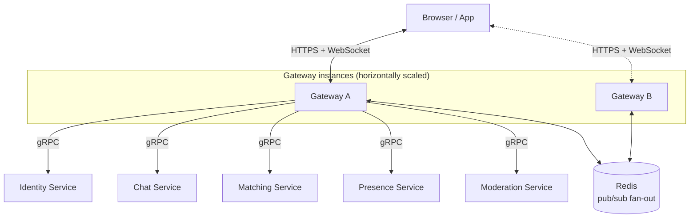
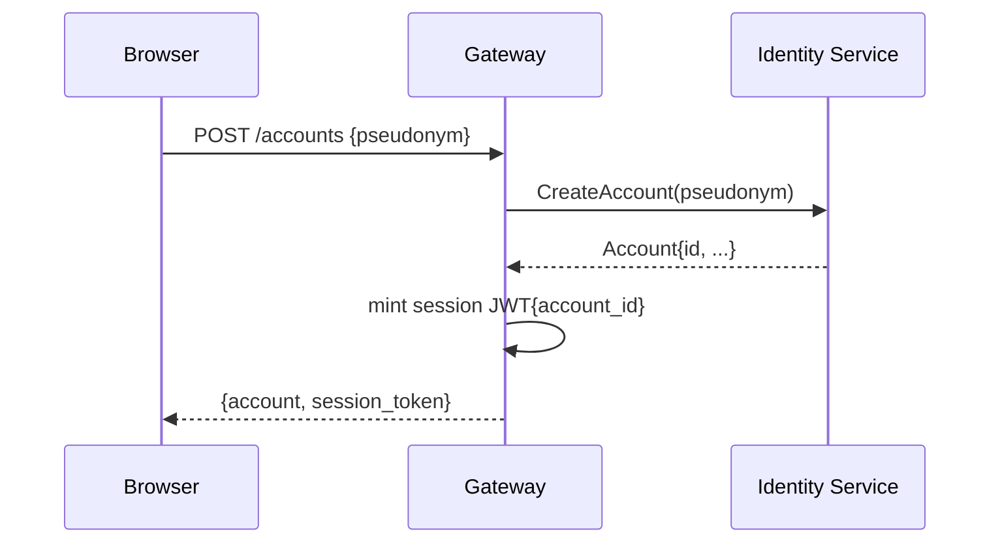
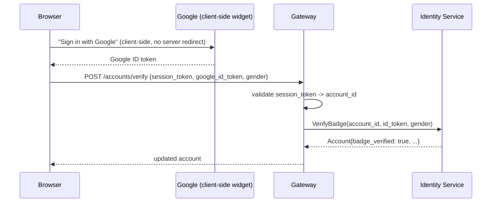
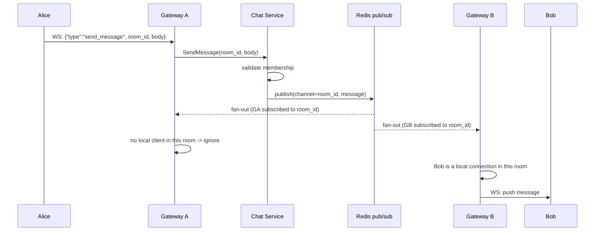

# API Gateway architecture

Design notes for the API Gateway, written up before implementation started so the reasoning is on record, not just in chat history. Companion to [SYSTEM_DESIGN.md](../SYSTEM_DESIGN.md) - that doc's Gateway row/section is the one-line summary, this is the walkthrough behind it.

## Role

Gateway is the only thing the browser/app ever talks to. Every other service (Identity, Chat, Matching, Presence, Moderation) speaks gRPC only and is never reachable from outside the cluster. Gateway's job is translation: browser-facing HTTP/WebSocket in, internal gRPC calls out, and the reverse on the way back - the standard "API Gateway / Backend-for-Frontend" pattern, not something specific to this project.

Only Gateway A's gRPC edges are drawn to keep the diagram readable - Gateway B has the identical set of edges to every backend service.

## Two protocol shapes Gateway has to speak

| Shape | Used for | Notes |
|---|---|---|
| Plain HTTP request/response | Sign up, get account, verify badge, create/join a group by code | One-shot actions, translated 1:1 into a single gRPC call |
| WebSocket (long-lived, two-way) | Live chat messages, match found notifications, presence pushes | Needs a small client-facing wire protocol (JSON frames with a `type` field), since raw gRPC doesn't run inside a browser WebSocket |

## Auth: two separate tokens

The most important thing to keep straight: there are two unrelated tokens involved, and only one of them is ongoing.

- **Google's OAuth ID token** - only exists during the "get verified" step. Proves "this email belongs to this Google account." Short-lived, Google-issued, never stored.
- **Gateway's own session token** - a JWT Gateway signs itself, issued at signup (verified or not), sent back by the browser on every request/connection afterward. This is the actual, ongoing auth mechanism for the app.

**Sign up (unverified) - no Google involved at all:**

**Get verified (later, optional) - Google is only ever a source of a signed email claim:**

**Why only Gateway validates anything client-facing:** Identity/Chat/Matching/Presence/Moderation are never reachable from outside the cluster - that's a Kubernetes networking fact (no public Service/Ingress routes to them), not just a convention. They trust whatever `account_id` Gateway hands them over internal gRPC. Gateway is the entire trust boundary. See the "per-service auth" note below for when this choice would *not* be the right one.

## Real-time delivery across multiple Gateway instances

Once Gateway autoscales (per `SYSTEM_DESIGN.md`, it's one of the two services with an HPA), two people chatting might be connected to two different Gateway instances. Neither instance can reach into the other's in-memory WebSocket connections directly, so delivery can't just be "look up the recipient's socket and write to it." Redis pub/sub is the fan-out mechanism that solves this: whichever instance actually holds the recipient's connection is the one that picks the message up and pushes it down.

Each Gateway instance owns its own **local connection registry** (in-memory: which sockets are currently in which rooms) and subscribes to Redis channels only for rooms it currently has local clients in. Chat Service doesn't know or care which Gateway instance anyone is connected to - that's exactly the point.

## What's genuinely undecided (build-time, not design-time)

- WebSocket library (Go's standard library has no WebSocket support - needs a third-party package)
- JWT library for signing/verifying Gateway's own session tokens
- Rate limiting mechanism (in-memory per-instance is simplest to start; a distributed limiter needs Redis, same as the connection registry problem above)

## Related reading

- [SYSTEM_DESIGN.md](../SYSTEM_DESIGN.md) §1-3 - service boundaries and the message/match/presence data flows this diagram is a close-up of
- [PRD.md](../PRD.md) - the two-tier (unverified/verified) access model this auth design implements
- [docs/kb/04-auth-and-verification/04-01-oauth-and-oidc.md](../kb/04-auth-and-verification/04-01-oauth-and-oidc.md) - how Identity verifies the Google ID token Gateway hands it
